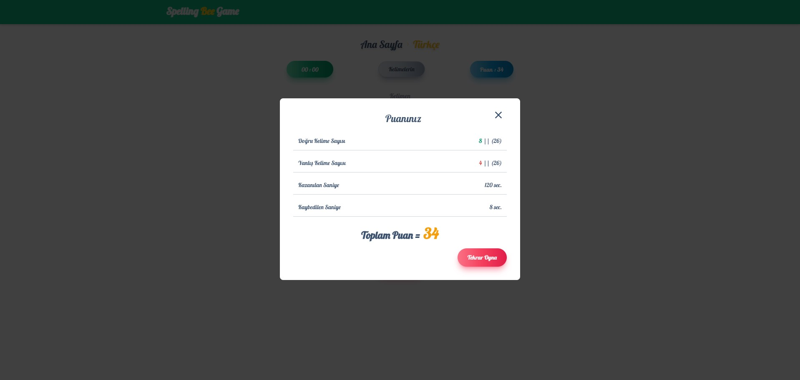

https://github.com/musayar9/Spelling-Bee/assets/96313325/2d52ec52-8390-402a-b554-1547e65dcec9

## Teknolojiler

## İçerik

Bu oyun  NextJs ve Tailwindcss teknolojileri kullanılarak  geliştirildi.

Proje içinde durum (state) yönetimi için useContext yapısı kullanıldı. Burada oluşturulan değişkenler diğer bileşenlere (components) dağıtıldı.

Bu oyunda oyuncuya 7 harf veriliyor. Oyuncuda  bu yedi harf kullanarak oluşturulabilecek kelimeleri bulması isteniyor. Kelimeleri bulmak için bir dakikanız var. Doğru bulduğunuz her kelime için 15 saniye ve kelimenin uzunluğu kadar puan kazanacaksınız.Her doğru yanıttan sonra verilen harflerin yeri değişmektedir. Her yanlış kelime için 2 puan kaybedeceksiniz.

Oyun ilk yüklendiğinde, ana sayfada oyuncuya oyun hakkında bilgilendirme yapılıyor. Oyuncuya oyunu oynamak için Türkçe ve İngilizce versiyonları seçme imkanı sunuluyor. Oyuncu hangi versiyonu seçerse, oyunu o dilde oynayacak ve kelimeleri o dil yapısına uygun olarak bulmaya çalışacaktır.

## Türkçe version

Yukarıdaki resimde oyunun türkçe versionunu görüyorsunuz.

Sayfa'da;

- Yeşil okla gösterilen alan, oyun için kullanıcıya verilen süreyi gösteriyor.

- Mavi okla gösterilen alan, oyuncunun kazandığı puanı gösteriyor.

- Sarı okla gösterilen alan, oyuncunun kelime gireceği yerdir.

- Gri okla gösterilen alanda, kullanıcının bulduğu kelimeler bir tablo içinde gösterilecek.

- Sarı okla gösterilen alan ise kullanıcıya sunulan 7 harfin olduğu alanı gösteriyor.

## Doğru Kelime

Kullanıcı doğru kelimeyi bulduğunda;

- Ekranın ortasında doğru bildiğine dair bir bilgilendirme mesajı çıkmaktadır.

- Doğru kelime'yi bulduğunda süresine +15 saniye eklenmektedir.

- Kelimenin uzunluğuna göre puan kazanmaktadır. Örneğin `tanım` kelimesini buldu o zaman 5 puan kazanmaktadır.

- Bulunan her kelime `kelimelerin` adlı tablo içine eklenmektedir.
  
- Bulunan kelimeyi bir daha girdiğinizde bu kelimenin önceden bulduğuna dair bilgilendirme mesajı almaktasınız.
  

## Yanlış Kelime

Oyuncu yanlış kelime girdiğinde veya kelime bulunamadığında;

- Kullanıcının puanından  2 puan silinmektedir.

- Ekranın ortasında yanlış bildiğine dair bir bilgilendirme mesajı çıkmaktadır.

- Kelime yok ise `Kelimen` tablosuna verinin eklenmediğine dair bilgi gösterilmektedir.

## Sonuç

1. Oyuncuta verilen süre sona erdiğinde;

Oyunucunun girdiği doğru ve yanlış kelime sayısı, kazandığı ve kaybettiği toplam süre ve kazandığı toplam puan hesaplanıp oyuncuya gösterilmektedir.

2. Oyuncu verilen harfler ilgili tüm kelimeleri bulduğunda ise;

Oyun durmakta ve oyunucuya bir modal açılmaktadır. Bu modal da oyuncuya bütün kelimeleri bulduğunda dair bilgi mesajı verilmekte ve girdiği doğru ve yanlış kelime sayısı, kazandığı ve kaybettiği toplam süre ve kazandığı toplam puan gösterilmektedir.

Oyuncu süre bittiğinde veya bütün kelimeleri bulduğunda kendi gösterilen tekrar oyna butonuna tıkladığında bu veriler sıfırlanacak ve oyuna yeniden başlayabilecektir.
