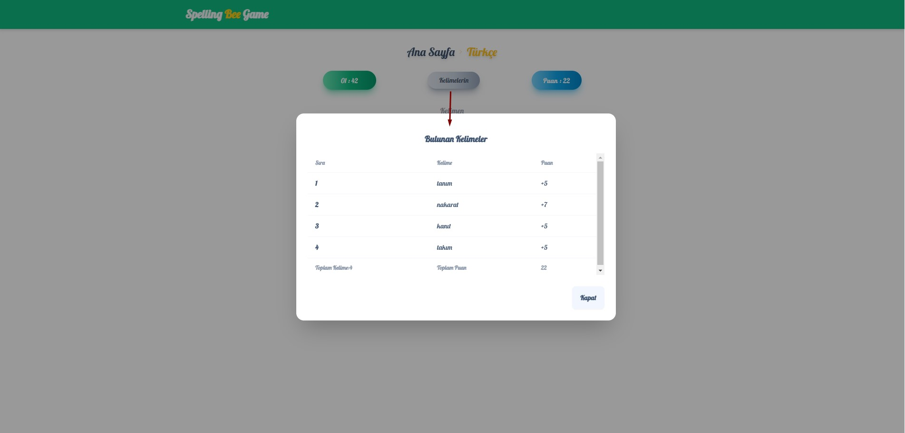

## Teknolojiler

## İçerik

Bu projede NextJs ve Tailwindcss kullanılarak bir `Spelling Bee Game`. oyunu geliştirildi

Proje içinde durum (state) yönetimi için useContext yapısı kullanıldı. Burada oluşturulan değişkenler diğer bileşenlere (components) dağıtıldı.

Bu oyunda oyuncuya 7 harf veriliyor. Bu yedi harf kullanılarak oluşturulabilecek kelimeleri bulmaya çalışıyorsunuz. Kelimeleri bulmak için bir dakikanız var. Doğru bulduğunuz her kelime için 15 saniye ve kelimenin uzunluğu kadar puan kazanacaksınız.Her doğru yanıttan sonra verilen harflerin yeri değişmektedir. Her yanlış kelime için 2 puan kaybedeceksiniz.

Oyun ilk yüklendiğinde, ana sayfada oyuncuya oyun hakkında bilgilendirme yapılır. Oyuncuya oyunu oynamak için Türkçe ve İngilizce versiyonları seçme imkanı sunulur. Oyuncu hangi versiyonu seçerse, oyunu o dilde oynayacak ve kelimeleri o dil yapısına uygun olarak bulmaya çalışacaktır.

## Türkçe version

Yukarıdaki resimde oyunun türkçe versionunu görüyorsunuz.

Sayfada;

- Yeşil okla gösterilen alan, oyun için kullanıcıya verilen süreyi gösteriyor.

- Mavi okla gösterilen alan, oyuncunun kazandığı puanı gösteriyor.

- Sarı okla gösterilen alan, oyuncunun kelime gireceği yerdir.

- Gri okla gösterilen alanda, kullanıcının girdiği kelimenin çıktısı gösterilecek.

- Sarı okla gösterilen alan ise kullanıcıya sunulan 7 harfli olduğu alanı gösteriyor.

## Doğru Kelime

Kullanıcı doğru kelimeyi bulduğunda;

- Ekranın ortasında doğru bildiğine dair bir bilgilendirme mesajı çıkmaktadır.

- Doğru kelime'yi bulduğunda süresine +15 saniye eklenmektedir.

- Kelimenin uzunluğuna göre puan kazanmaktadır. Örneğin `tanım` kelimesini buldu o zaman 5 puan kazanmaktadır.

- Bulunan her kelime `kelimelerin` adlı tablo içine eklenmektedir
  
